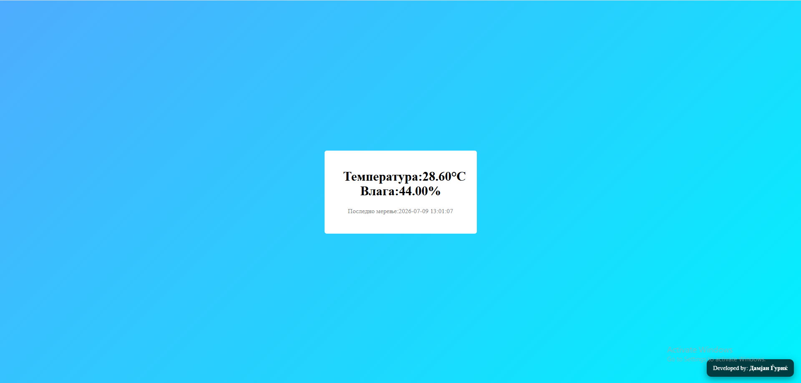

# 🌡 Arduino Weather Station

Arduino Weather Station е проект кој комбинира Arduino и веб апликација за мерење и прикажување на температура и влажност во реално време.

---

## 📌 Главни функции

- Real-time temperature monitoring
- Real-time humidity monitoring
- Arduino sensor integration
- Web dashboard
- Automatic data updates
- Database storage
- Simple user interface

---

## 🛠 Користени технологии

### Хардвер

- Arduino Uno
- DHT11 Temperature and Humidity Sensor

### Софтвер

- Arduino IDE
- HTML5
- CSS3
- JavaScript
- PHP
- MySQL
- XAMPP

---

## 📷 Screenshots

*### ✅ Result



---

## ⚙ Инсталација
1. Копирај го репозиториумот
2. Поврзи го сензорот со arduino
3. Прикачи го кодот во arduino IDE 
4. Копирај ја папката во xampp/htdocs
5. Стартувај ги Apache и MySQL преку XAMPP.
6. Импортирај ја базата monitoring.sql во phpMyAdmin.
7. Отвори:
   http://localhost/Weather_station

---

## 📂 Project Structure

```text
arduino-weather-station
│
├── Source/
|  ├── Index.html
│  ├── insert.php
|  ├── read.php
|  ├── Connect.py
|  ├── script.js
|  ├── style.css
|
├── Database/
|  └── monitoring.sql
│
├── Screenshots/
|  └── Result.png
│
├── README.md
└── LICENSE
